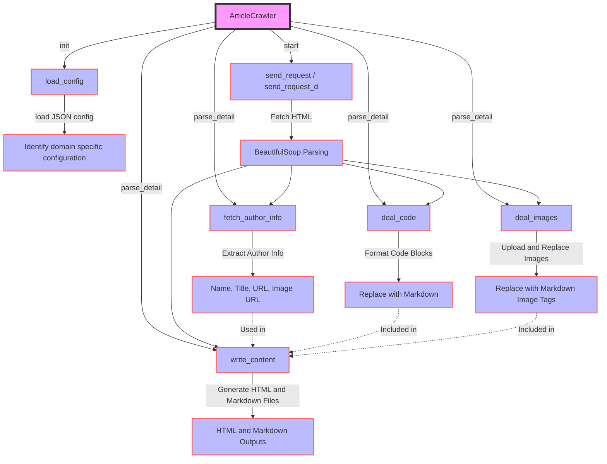

# article_crawler

## 项目简介
`article_crawler`是一个用于爬取并保存文章内容的Python脚本。它支持从掘金(juejin)和知乎(zhihu)等平台上爬取文章。

## 安装指南
本项目使用Python编写，要运行此脚本，您需要先确保已安装Python环境。

1. 克隆仓库到本地：
   ```
   git clone https://github.com/your-repository/article_crawler.git
   ```
2. 安装依赖：
   ```
   pip install -r requirements.txt
   ```

## 使用方法

python article_crawler.py -u <文章URL> -o <输出目录>

示例：
python article_crawler.py -u https://www.jianshu.com/p/609878670 -o ./data


## 功能特性
- 支持从掘金,知乎,csdn和简书平台爬取文章。
- 简单易用，通过命令行参数控制
- 代码自动识别并高亮
- 图片自动转存到自己的图床

